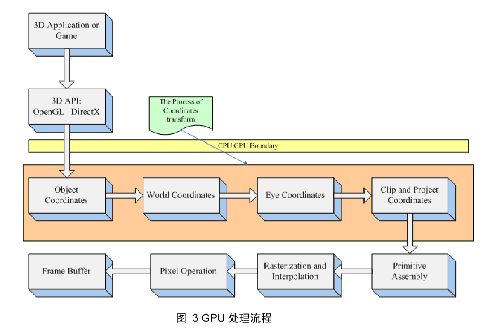
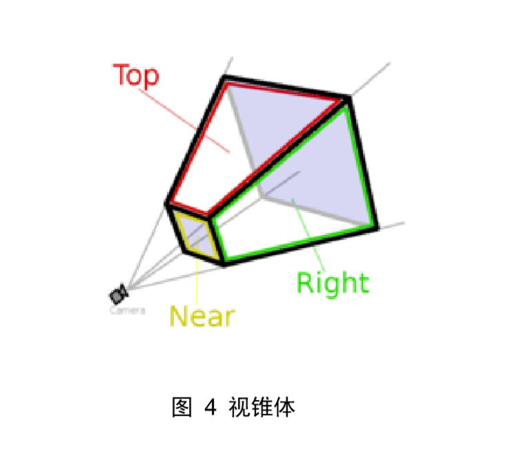
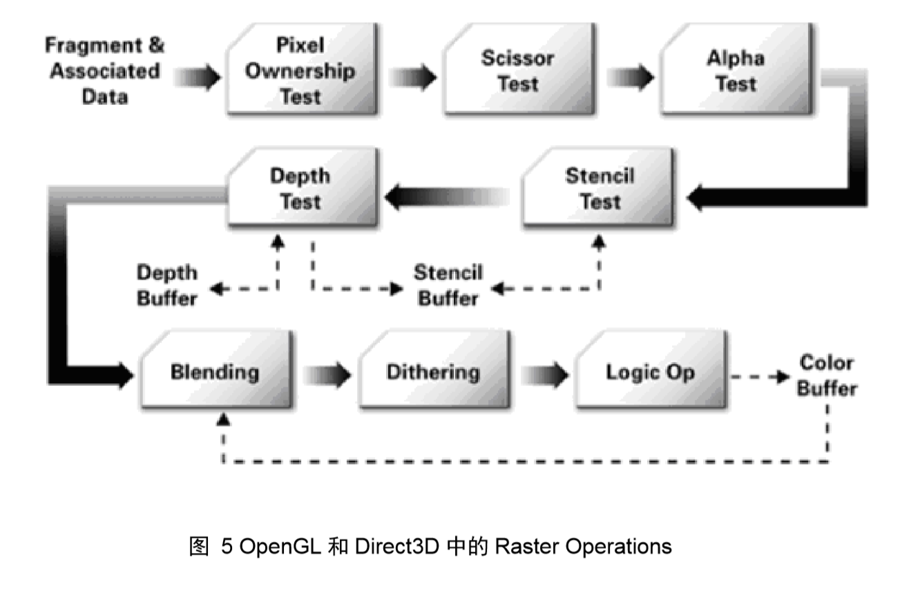
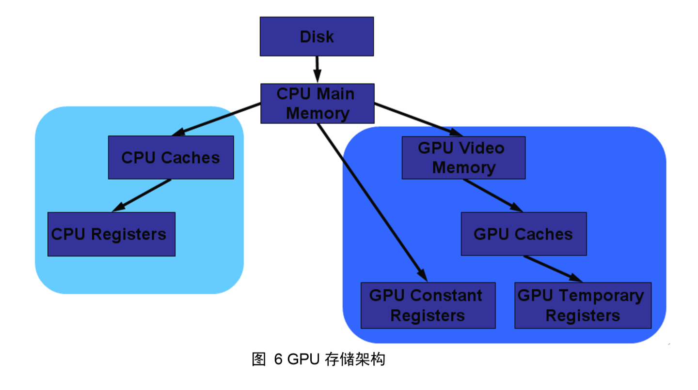

## 第02章  GPU 图形绘制管线
 

> 万事开头难，每门科学都是如此。 
　　　　　　　　------ 马克思
 
　　图形绘制管线描述 GPU 渲染流程，即“给定视点、三维物体、光源、照明模式，和纹理等元素，如何绘制一幅二维图像”。本章内容涉及 GPU 的基本流程和实时绘制技术的根本原理，在这些知识点之上才能延申发展出基于 GPU 的各项技术，所以本章的重要性怎么说都不为过。欲登高而穷目，勿筑台于浮沙！
 
 
　　本章首先讨论整个绘制管线（不仅仅是 GPU 绘制）所包含的不同阶段，然后对每个阶段进行独立阐述，最后讲解 GPU 上各类缓冲器的相关知识点。
 
 
　　在《实时计算机图形学》一书中，将图形绘制管线分为三个阶段：应用程序阶段、几何阶段、光栅化阶段。
 
 
　　应用程序阶段，使用高级编程语言（C/C++、Java、OC等等）进行开发，主要和 CPU、内存打交道，诸如碰撞检测、场景图建立、空间八叉树更新、视锥裁剪等经典算法都在此阶段执行。在该阶段的末端，几何体数据（顶点坐标、法向量、纹理坐标、纹理等）通过数据总线传送到图形硬件（时间瓶颈）；数据总线是一个可以共享的通道，用于在多个设备之间传送数据；端口是在两个设备之间传送数据的通道；带宽用来描述端口或者总线上的吞吐量，可以用每秒字节（b/s）来度量，数据总线和端口（如加速图形端口，Accelerated Graphic Port，AGP）将不同的功能模块“粘接”在一起。由于端口和数据总线均具有数据传输能力，因此通常也将端口认为是数据总线（《实时计算机图形学》387页）
 
 
　　几何阶段，主要负责顶点坐标变换、光照、裁剪、投影以及屏幕映射（《实时计算机图形学》234页），该阶段基于 GPU 进行运算，在该阶段的末端得到了经过变换和投影之后的顶点坐标、颜色、以及纹理坐标（《实时计算机图形学》10页）。
 
 
　　光栅化阶段，基于几何阶段的输出数据，为像素（Pixel）正确配色，以便绘制完整图像，该阶段进行的都是单个像素的操作，每个像素的信息存储在颜色缓冲区（Color Buffer 或者 Frame Buffer）中。
 
 
　　值得注意的是：光照计算属于几何阶段，因为光照计算涉及视点、光源和物体的世界坐标，所以通常放在世界坐标系中进行计算；而雾化以及涉及物体透明度的计算属于光栅化阶段，因为上述两种计算都需要深度值信息（Z 值），而深度值是几何阶段中计算，并传递到光栅化阶段的。
 
 
　　下面具体阐述从几何阶段到光栅化阶段的详细过程。
 

### 2.1 几何阶段

　　在看这部分内容之前我们先简单描述一下应用程序阶段主要做了些什么： 
  
>　　从名字上我们可以看出，这个阶段是由我们的应用主导的，因此通常由 CPU 负责实现。换句话说，我们这些开发者具有这个阶段的绝对控制权。 
　　在这一阶段中，开发者有 3 个主要任务：首先，我们需要准备好场景数据，例如摄像机的位置、视锥体、场景中包含了哪些模型、使用了哪些光源等等；其次，为了提高渲染性能，我们往往需要做一个粗粒度剔除（culling）工作，以把那些不可见的物体剔除出去，这样就不需要再移交给几何阶段进行处理；最后，我们需要设置好每个模型的渲染状态。这些渲染状态包括但不限于它使用的材质（漫反射颜色、高光反射颜色）、使用的纹理、使用的 Shader 等。这一阶段最重要的输出是渲染所需的几何信息，即**渲染图元**（rendering primitives）。通俗来讲，渲染图元可以是点、线、三角面等。这些渲染图元会被传递到下一阶段，也就是我们将要详细讲解的——几何阶段。

　　几何阶段的主要工作是“变换三维顶点坐标”和“光照计算”，显卡信息中通常会有一个标示为“T&L”的硬件部分，所谓“T&L”即 Transform & Lighting。那么为什么要对三维顶点进行坐标空间变换？或者说，对三维顶点进行坐标空间变换有什么用？为了解释这个问题，我先引用一个段文献【3】中的一段叙述：
  
　　Because, your application supplies the geomertric data as a collection of vertices, but the resulting image typically represents what an observer or camera would see from a particular vantage point.
 
　　As the geometric data flows through the pipeline, the GPU's vertex processor transforms the continuant vertices into one or more different coordinate system, each of which serves a particular purpose. CG vertex proprams provide a way for you to program these tansformations yourself.
  
　　上述英文意思是：输入到计算机中的是一系列三维坐标点，但是我们最终需要看到的是，从视点出发观察到的特定点（这句话可以这样理解，三维坐标点，要使之显示在二维的屏幕上）。一般情况下，GPU 帮我们自动完成了这个转换。基于 GPU 的顶点程序为开发人员提供了控制顶点坐标空间转换的方法。
  
　　一定要牢记，显示屏是二维的，GPU 所需要做的是将三维的数据，绘制到二维屏幕上，并达到“跃然纸上”的效果。顶点变换中的每个过程都是为了这个目的而存在，为了让二维的画面看起具有三维立体感，为了让二维的画面看起来“跃然纸上”。
  
　　根据顶点坐标变换的先后顺序，主要有如下几个坐标空间，或者说坐标类型：Object Space，模型坐标空间；World Space，世界坐标空间；Eye Space，观察者坐标空间；Clip and Project Space，屏幕坐标空间。图 3 表述了 GPU 的整个处理流程，其中茶色区域所展示的就是顶点坐标空间的变换流程。大家从中只需得到一个大概的流程顺序即可，下面将详细阐述空间变换的每个独立阶段。
  

 

#### 2.1.1 从 Object Space 到 World Space

　　When an artist creates a 3D model of an object, the artist selects a convenient orientation and position with which to place the model's continent vertices. 
 
　　The object space for one object may have no relationship to the object space of another object.【3】
  
　　上述语句表示了 Object Space 的两层核心含义：其一，Object Space Coordinate 就是模型文件中的顶点值，这些值是在模型建模时得到的，例如，用 3DMAX 建立一个球体模型并导出为 .max 文件，这个文件中包含的数据就是 Object Space Coordinate；其二，Object Space Coordinate 于其他物体没有任何参照关系，注意，这个概念非常重要，它是将 Object Space Coordinate 和 World Space Coordinate 区分开来的关键。无论在现实世界，还是在计算机的虚拟空间中，物体都必须和一个固定坐标原点进行参照才能确定自己所在的位置，这是 World Space Coordinate 的实际意义所在。
  
　　毫无疑问，我们将一个模型导入计算机后，就应该给它一个相对于坐标原点的位置，那么这个位置就是 World Space Coordinate，从 Object Space Coordinate 到 World Space Coordinate 的变换过程由一个四阶矩阵控制，通常称之为 World Matrix。
  
　　光照计算通常是在 World Space Coordinate（世界坐标空间）中进行的，这也符合人类的生活常识。当然，也就可以在 Eye Coordinate Space 中得到相同的光照效果，因为，在同一个观察空间中物体之间的相对关系是保持不变的。
  
　　需要高度注意的是：顶点法向量在模型文件中属于 Object Space，在 GPU 的顶点程序中必须将法向量转换到 World Space 中才能使用，如同必须将顶点坐标从 Object Space 转换到 World Space 中一样，但两者的转换矩阵是不同的，准确的说，法向量从 Object Space 到 World Space 的转换矩阵是 World Matrix 的转置矩阵的逆矩阵（许多人在顶点程序中会将两者的转换矩阵当作同一个，结果会出现难以查找的错误）。（参阅潘李亮的 3D 变换中法向量变换矩阵的推导一文）
  
　　可以阅读电子工业出版社的《计算机图形学（第二版）》第11章，进一步了解三维顶点变换具体的计算方法，如果对矩阵运算感到陌生，则有必要复习一下线性代数。
 

#### 2.1.2 从 World Space 到 Eye Space

　　每个人都是从各自的视点出发观察这个世界，无论是主观世界还是客观世界。同样，在计算机中每次只能从唯一的视角出发渲染物体。在游戏中，都会提供视点漫游的功能，屏幕显示的内容随着视点的变化而变化。这是因为 GPU 将物体顶点坐标从 World Space 转换到了 Eye Space。
  
　　所谓 Eye Space，即以 Camera （视点或相机）为原点，由视线方向、视角和远近平面，共同组成一个梯形体的三维空间，称之为 Viewing Frustum（视锥），如图 4 所示。近平面，是梯形体较小的矩形面，作为投影平面，远平面是梯形体较大的矩形，在这个梯形体中的所有顶点数据都是可见的，而超出这个梯形体之外的场景数据，会被视点去除（Frustum Culling，也称之为视锥裁剪）。
  

 

#### 2.1.3 从 Eye Space 到 Project and Clip Space

　　Once positions are in eye space, the next step is to determine what postions are actually viewable in the image you eventually intend trend.【3】
  
　　即：一旦顶点坐标被转换到 Eye Space 中，就需要判断哪些点是视点可见的。位于 Viewing Frustum 梯形体以内的顶点，被认定为可见，而超出这个梯形体以外的场景数据，会被视点去除（Frustum Culling，也称之为视锥裁剪）。这一步通常称之为“Clip（裁剪）”，识别指定区域内或区域外的图形部分的过程称之为裁剪算法。
  
 　　很多人在理解该步骤时存在一个混乱，即“不清楚裁剪与投影的关系和两者发生的先后顺序”，不少人觉得是“先裁剪再投影”，不过事实并非如此。因为在不规则的梯形体（viewing frustum）中进行裁剪并非易事，所以经过图形学前辈们的精心分析，裁剪被安排到一个单位立方体中进行，该立方体的对角顶点分别是（-1，-1，1）和（1,1,1），通常称这个单位立方体为规范立方体（Canonical View Volume，CVV）（实时计算机图形学第 9 页）。CVV 的近平面（梯形体较小的矩形面）的X、Y坐标对应屏幕像素坐标（左下角是0、0），Z 坐标则是代表画面像素深度。
   
  　　多边形裁剪就是 CVV 中完成的。所以，从视点坐标空间到屏幕坐标空间（Screen Coordinate Space）事实上是由三步组成：  
  　　1. 用透视变换矩阵把顶点从视锥体中变换到裁剪空间的 CVV 中；  
  　　2. 在 CVV 进行图元裁剪；  
  　　3. 屏幕映射：将经过前述过程得到的坐标映射到屏幕坐标系上。    
  　　在这里，我们尤其要注意第一个步骤，即把顶点从 Viewing Frustum 变换到 CVV 中，这个过程才是我们常说或者听说的“投影”。主要的投影方法有两种：正投影（也称平行投影）和透视投影。由于透视投影更加符合人类的视觉习惯，所以在附录中会详细讲解透视投影矩阵的推导过程，有兴趣的朋友可以查阅潘宏（网名 Twinsen）的“透视投影变换推导”一文。更详细全面的投影算法可以进一步阅读《计算机图形学（第二版）》第12章-第3节。
   
 　　确定只有哦当图元完全或部分的存在于视锥内部时，才需要将其光栅化。当一个图元完全位于视体（此时视体以及变换为 CVV）内部时，它可以直接进入下一个阶段；完全在视体外部的图元，将被剔除；对于部分位于视体内的图元进行裁剪处理。详细的裁剪算法可以进一步阅读《计算机图形学（第二版）》第12章-第5节。
   
 　　附 1：透视投影矩阵的推导过程，建议阅读潘宏（网名 Teinsen）的“透视投影变换推导”一文。
 
 　　附 2：视点去除，不但可以在 GPU 中进行，也可以使用高级语言（C\C++）在 CPU 上实现。使用高级语言实现时，如果一个场景实体完全不在视锥中，则该实体的网格数据不必传入 GPU，如果一个场景实体部分或完全在视锥中，则该实体网格数据传入 GPU 中。所以如果在高级语言中已经进行了视点去除，那么可以极大的减去 GPU 的负担。使用 C++ 进行视锥裁剪的算法可以参阅 OGRE （Object-Oriented Graphics Rendering Engine，面向对象的图形渲染引擎）的源码。
 

### 2.2 Primitive Assembly && Triangle Setup

 　　Primitive Assembly，图元装配，即将顶点根据 Primitive（原始的连接关系），还原出网格结构。网格由顶点和索引组成，在之前的流水线中是对顶点的处理，在这个阶段是根据索引将顶点链接在一起，组成线、面单元。之后就是对超出屏幕外的三角形进行裁剪，想象一下：一个三角形其中一个顶点在画面外，另外两个顶点在画面内，这时我们在屏幕上看到的就是一个四边形。然后将该四边形切成两个小的三角形。
  
 　　此处还有一个操作涉及到三角形的顶点顺序（其实也就是三角形的法向量朝向），根据右手定则来决定三角面片的法向量，如果该法向量朝向视点（法向量与到视点的方向的点积为正），则该面是正面。一般是顶点按照逆时针排列。如果该面是反面，则进行背面去除操作（Back-Face Culling）。在 OpenGL 中有专门的函数 enable 和 disable 背面去除操作。所有的裁剪剔除计算都是为了减少需要绘制的顶点个数。
  
 　　附：在 2.2 和 2.3 节都提到了裁剪的概念，实际裁剪是一个较大的概念，为了减少需要绘制的顶点个数，而识别制定区域内或区域外的图形部分的算法都称之为裁剪。裁剪算法主要包括：视域剔除（View Frustum Culling）、背面剔除（Back-Face Culling）、遮挡剔除（Occlusing Culling）和市口裁剪等。
  
 　　处理三角形的过程被称为 Triangle Setup。到目前为止，我们得到了一堆在屏幕坐标上的三角面片，这些面片是用于做光栅化的（Rasterizing）。
 

### 2.3 光栅化阶段

>这一阶段将会使用上个阶段传递的数据来产生屏幕上的像素，并渲染出最终的图像。这一阶段也是在 GPU 上运行。光栅化的任务主要是决定每个渲染图元中的哪些像素应该被绘制在屏幕上。它需要对上一个阶段得到的逐顶点数据（例如纹理坐标、顶点颜色等）进行插值，然后再进行逐像素处理。

#### 2.3.1 Rasterization

 　　光栅化：决定哪些像素被集合图元覆盖的过程（Rasterization is the process of determining the set of pixels covered by a geometric primitive）。经过上面诸多坐标转换之后，现在我们得到了每个点的屏幕坐标值（Sceen Coordinate），也知道我们需要绘制的图元（点、线、面）。但此时还存在两个问题：
  
 　　问题一：点的屏幕坐标值是浮点数，但像素都是由整数点来表示的，如何确定屏幕坐标值所对应的像素？
 
 　　问题二：在屏幕上需要绘制有点、线、面，如何根据两个已经确定位置的2个像素点绘制一条线段，如何根据已经确定了位置的 3 个像素点绘制一个三角形面片？
  
 　　首先回答一下问题一，“绘制的位置只能接近两指定端点间的实际线段位置，例如，一条线段的位置是（10.48，20.51），转换为像素位置则是（10，21）”（计算机图形学（第二版）52页）。
 
 　　对于问题二涉及到具体的画线算法，以及区域图元填充算法。通常的画线算法有 DDA 算法、Bresenham 画线算法；区域图元填充算法有，扫描线多边形填充算法、边界填充算法等，具体请参阅《计算机图形学（第二版）》第3章。
  
 　　这个过程结束之后，顶点（vertex）以及绘制图元（线、面）已经对应到像素（pixel）。下面阐述的是“如何处理像素，即：给像素赋予颜色值”。
 

#### 2.3.2 Pixel Operation

 　　Pixel Operation 又称为 Raster Operation （在文献【2】中是使用 Raster Operation），是在更新帧缓存之前，执行最后一系列针对每个片段的操作，其目的是：计算出每个像素的颜色值。在这个阶段，被遮挡面通过一个被称为深度测试的过程而消除，这其中包含了很多种计算颜色的方法以及技术。Pixel Operation 包含哪些事情呢？
  
 　　1. 消除遮挡面； 
 　　2. Texture Operation，纹理操作，也就是根据像素的纹理坐标，查询对应的纹理值； 
 　　3. Blending； 
 　　混色，根据目前已经画好的颜色，与正在计算的颜色的透明度（Alpha），混合为两种颜色，作为新的颜色输出。通常称之为 alpha 混合技术。当在屏幕上绘制某个物体时，与每个像素都相关联的有一个 RGB 颜色值和一个 Z 缓冲区深度值，另外一个称为 alpha 值，可以根据需要生成并存储，用来描述给定像素处的物体透明度。如果 alpha 值为 1.0，则表示物体不透明；如果值为 0，表示该物体是透明的。
 
 　　从绘制管线得到一个 RGBA，使用 over 操作符将该值与原像素颜色值进行混合，公式如下： 
 　　newColor = alpha * alphaColor + （1 - alpha）* preColor  【over 操作符】  
 　　alpha 是透明度值，alphaColor 表示透明物体的颜色，preColor表示混合前像素的颜色值，newColor是最终计算得到的颜色值。Over 操作可以用于照片混合和物体合成绘制方面，这个过程称为合成（compositing）。可以联想一下，OGRE 中有一种技术称为 compositor（合成器）。
 
 　　此外还需要提醒的一点是：为了在场景中绘制透明物体，通常需要对物体进行排序。首先，绘制不透明的物体；然后，在不透明的物体的上方，对透明物体按照由后到前的顺序进行混合处理。如果按照任意顺序进行混合，那么会产生严重的失真。既然需要排序，那么就需要用到 Z Buffer。关于透明度、合成的相关知识点，可以在《实时计算机图形学（第二版）》第四章4.5节（59页）中得到更多详尽的知识。
 
 　　4. Filtering，将正在算的颜色经过某种 Filtering （滤波或者滤镜）后输出。可以理解为：经过一种数学运算后变成新的颜色值。 
 　　该阶段之后，像素的颜色值被写入帧缓存中。图 5 来自文献【2】1.2.3，说明了像素操作的流程：
  

 

### 2.4 图形硬件

 　　这一节中主要阐述图形硬件的相关知识，主要包括 GPU 中数据的存放硬件，以及各类缓冲区的具体含义和用途，如：Z Buffer（深度缓冲区）、Stencil Buffer（模板缓冲区）、Frame Buffer（帧缓冲区）和 Color Buffer （颜色缓冲区）。
 

#### 2.4.1 GPU 内存架构

 　　寄存器和内存由什么区别？  
 　　从物理结构而言，寄存器是 CPU 或 GPU 内部的存储单元，即寄存器是嵌入在 CPU 或者 GPU 中的，而内存则可以独立存在；从功能上而言，寄存器是有限存储容量的高速存储部件，用来暂存指令、数据和位址。Shader 编程是基于计算机图形硬件的，这其中就包括 GPU 上的寄存器类型，GLSL 和 HLSL 的着色虚拟机版本就是基于 GPU 的寄存器和指令集而区分的。
  

 
#### 2.4.2 Z Buffer 与 Z 值

 　　Z Buffer 应该是大家最为熟悉的缓冲区类型，又称为 Depth Buffer，即深度缓冲区，其中存放的是视点到每个像素所对应的空间点的距离衡量，称之为 Z 值或者深度值。可见物体的 Z 值范围位于【0，1】区间，默认情况下，最接近眼睛的顶点（近裁剪面上）其 Z 值为 0.0，离眼睛最远的顶点（远裁剪面上）其 Z 值为 1.0。使用 Z Buffer 可以用来判断空间点的遮挡关系，著名的深度缓冲区算法（depth-buffer method，又称 Z 缓冲区算法）就是对投影平面上每个像素所对应的 Z 值进行比较的。
  
 　　Z 值并非真正的笛卡尔空间坐标系中的欧几德得距离（Euclidean distance），而是一种“顶点到视点距离”的相对度量。所谓相对度量，即这个值保留了与其他同类型值得相对大小关系。在 Steve Baker 撰写的文章“Learning to love your Z-buffer”中将 GPU 对 Z 值得计算公式描述为：
  
 　　z_buffer_value = (1<<N)*(a*z + b)/z  
 　　a = f/(f - n)  
 　　b = f * n/(n - f)  
  
 　　其中 f 表示视点到远裁剪面的空间距离，n 表示视点到近裁剪面的空间距离，z 表示视点到顶点的空间距离，N 表示 Z 值精度。
  
 　　大多数人所忽略的是，Z Buffer 中存放的 Z 值不一定是线性变化的。在正投影中同一图元相邻像素的 Z 值是线性关系的，但在透视投影中却不是的。在透视投影中这种关系是非线性的，而且非线性的成都随着空间点到视点的距离增加而越发明显。
  
 　　当 3D 图形处理器将基础图元（点、线、面）渲染到屏幕上时，需要以逐行扫描的方式进行光栅化。
#### 2.4.3 Stencil Buffer
#### 2.4.4 Frame Buffer

### 2.5 本章小节

 　　本章介绍了 GPU 图形绘制管线，并对相关的图形硬件进行了阐述。图形绘制管线是 GPU 编程的基础，事实上顶点着色程序和片段着色程序正是按照图形绘制管线而划分的。
  
 　　国内的 OpenGPU 网站上由一些资料可以进一步阅读，北京大学出版社出版的《实时计算机图形学（第二版）》的第2章和第3章，以及 Blinn 的《A Trip Down the Graphics Pineline》在学习绘制管线方面呢也是非常好的资料。

