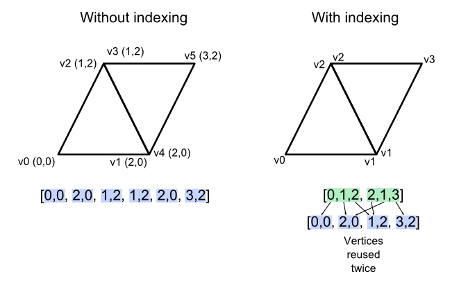
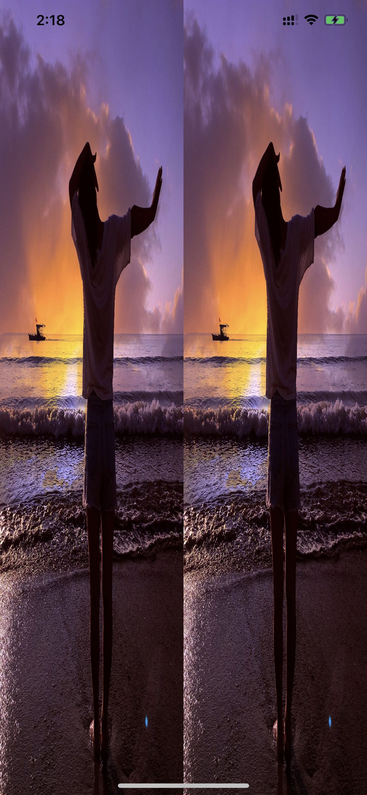

## ios-glkit

>不积跬步，无以至千里；不积小流，无以成江海。<br>
　　　　　　　　　　　　　　　-----《荀子》

#### 环境

>XCode Version 11.3.1 (11C504)<br>
OpenGL ES 2.0

#### 目的

>通过 GLKView 和 OpenGL ES 2.0 相关基础展示一张纹理的渲染效果

#### 效果


#### 步骤

- 准备顶点数据和索引数据（也就是我们经常说的顶点数组&索引数组）

    >顶点数组包含的是顶点坐标，在GLES里，世界坐标系是[-1,1]，点（0,0）就是屏幕的正中心，纹理坐标系的取值范围是[0,1]，坐标原点在左下角；索引数组是顶点数组的索引，vertices可以认为存在4个顶点，每个顶点存在5哥GLFloat数据，索引从0开始。

```
    // 顶点数据结构;
    typedef struct {
        GLKVector3 positionCoords; // 顶点坐标;
        GLKVector2 textureCoords; // 纹理坐标;
    } VertexStruct;

    // 内容是顶点数据，前三个是顶点坐标（x、y、z）坐标范围（-1，1），后两个是纹理坐标（x，y）坐标范围（0，1）;
    static const VertexStruct vertices[] = {
        // 右上三角形;
        {{1.0, -1.0, 0.0f,}, {1.0f, 0.0f}}, // 右下;
        {{1.0, 1.0,  0.0f}, {1.0f, 1.0f}}, // 右上;
        {{-1.0, 1.0, 0.0f}, {0.0f, 1.0f}}, // 左上;

        // 左下三角形;
        {{1.0, -1.0, 0.0f}, {1.0f, 0.0f}}, // 右下;
        {{-1.0, 1.0, 0.0f}, {0.0f, 1.0f}}, // 左上;
        {{-1.0, -1.0, 0.0f}, {0.0f, 0.0f}}, // 左下;
    };
```

- 创建 OpenGL ES 2.0 上下文信息

    >关于 EAGLContext 要了解的非常多，这里只做一个简单的提醒吧！就是如果你的应用程序主动在同一线程上的两个或多个上下文之间切换，请在设置新的上下文作为当前上下文之前调用glFlush函数。这样可以确保先前提交的命令及时传递给图形硬件（也是我面试经常会问的问题）。

```
    self.eaglContext = [[EAGLContext alloc] initWithAPI:kEAGLRenderingAPIOpenGLES2]; // 采用兼容性更好的2.0版本（每个上下文都针对特定版本的OpenGL ES）；
```

- 创建 iOS GLKView 视图

    >GLKTextureLoader 获取纹理ID（也可以称之name）

```
    // 新建GLKView;
    CGRect glkViewFrame = CGRectMake(0, 0, self.view.frame.size.width, self.view.frame.size.height);
    GLKView *glkView = [[GLKView alloc] initWithFrame:glkViewFrame context:self.eaglContext];
    glkView.drawableColorFormat = GLKViewDrawableColorFormatRGBA8888;  // 颜色缓冲区格式;
    glkView.delegate = self; // 设置代理，处理 glkView 回调函数;
```

- 设置当前GL线程的上下文信息

```
    [EAGLContext setCurrentContext:self.eaglContext];
```

- 获取纹理ID，并设置到 iOS 提供的 GLKBaseEffect 类（shader program）

```
    // 纹理贴图;
    NSString* filePath = [[NSBundle mainBundle] pathForResource:@"for-test-001" ofType:@"jpeg"];
    NSDictionary* options = [NSDictionary dictionaryWithObjectsAndKeys:@(1), GLKTextureLoaderOriginBottomLeft, nil]; // GLKTextureLoaderOriginBottomLeft 纹理坐标系是反的;
    GLKTextureInfo* textureInfo = [GLKTextureLoader textureWithContentsOfFile:filePath options:options error:nil];
    
    // 着色器;
    self.baseEffect = [[GLKBaseEffect alloc] init];
    self.baseEffect.useConstantColor = GL_TRUE;
    self.baseEffect.constantColor = GLKVector4Make(1.0f, 1.0f, 1.0f, 1.0f);
    self.baseEffect.texture2d0.enabled = GL_TRUE;
    self.baseEffect.texture2d0.name = textureInfo.name;
```

- 填充顶点数据缓存（需要理解并熟记下面的方法）

    >glGenBuffers 创建顶点缓冲区对象，会申请一个”标识符“（存储缓冲对象名称的数组） <br>
    >glBindBuffer 官方解释：bind a named buffer object 其实就是把“标识符”绑定到GL_ARRAY_BUFFER上 <br>
    >glBufferData 为顶点缓冲区对象申请内存空间，并进行初始化(视传入的参数而定)，实际上就是把顶点数据从CPU内存复制到GPU显存 <br>
    >glEnableVertexAttribArray 是开启对应的顶点属性 <br>
    >glVertexAttribPointer 指定了渲染时索引值为 index 的顶点属性数组的数据格式和位置 <br>

```
    // Step0: 创建缓存对象;
    GLuint vboId, eboId;
    
    // Step1: 创建并绑定VBO 对象 传送数据;
    glGenBuffers(1, &vboId);
    glBindBuffer(GL_ARRAY_BUFFER, vboId); // 绑定指定标识符的缓存为当前缓存;
    glBufferData(GL_ARRAY_BUFFER, sizeof(vertices), vertices, GL_STATIC_DRAW);

    // Step2: 指定解析方式  并启用顶点属性&纹理坐标属性;
    glEnableVertexAttribArray(GLKVertexAttribPosition); // 顶点数据缓存;
    glVertexAttribPointer(GLKVertexAttribPosition, 3, GL_FLOAT, GL_FALSE, sizeof(VertexStruct), NULL + offsetof(VertexStruct, positionCoords));
    glEnableVertexAttribArray(GLKVertexAttribTexCoord0); // 纹理;
    glVertexAttribPointer(GLKVertexAttribTexCoord0, 3, GL_FLOAT, GL_FALSE, sizeof(VertexStruct), NULL + offsetof(VertexStruct, textureCoords));
```

#### 说明

 - 上面虽然附了代码和讲解，但是还是有很多没有做进一步讲解，例如 EAGLContext，想从事图形开发的童鞋可以自行 Baidu & Google 查阅。
 - 当然如果想进一步深入学习 OpenGL，建议阅读 [LearnOpenGL](https://learnopengl-cn.github.io/)，里面讲的非常细致，如果对 CG Shader 开发感兴趣，建议阅读 [GPU 编程与 CG 语言之阳春白雪下里巴人](https://github.com/yungangwang/Study-Notes/tree/master/Content/%E3%80%8AGPU%20%E7%BC%96%E7%A8%8B%E4%B8%8E%20CG%20%E8%AF%AD%E8%A8%80%E4%B9%8B%E9%98%B3%E6%98%A5%E7%99%BD%E9%9B%AA%E4%B8%8B%E9%87%8C%E5%B7%B4%E4%BA%BA%E3%80%8B)

 #### 思考

 - 使用EBO开始索引绘制，如何操作？能带来什么好处？

    > 首先理解 EBO 的概念，即 Element Buffer Objects，用来存储绘制物体的索引。所谓索引就是对顶点属性数组中元素的一个位置标记。使用索引绘图时，先通过顶点属性数组指定数据，然后利用指向这些数据的索引来指示 OpenGL 完成绘图。<font color="#dd0000">我们上面绘制了6个顶点，也就是2个三角形，其中左上和右下两个点是重复绘制的，如何用更少的顶点绘制这张图片呢？</font>

 - 首先我们需要了解下索引绘图的原理，如下图：

 

    >在左边图中，没有使用索引绘制矩形时，要重复指定重叠的顶点数据，V1 和 V2 都重复了，使用了6个顶点属性数据；右边的图中，使用索引绘制时，只需要指定顶点在属性数组中的索引即可，使用 0, 1, 2, 3 代表 V0, V1, V2, V3 顶点，绘制矩形一共指定了6个索引，使用4个顶点属性数据。<br>
        其实上面的例子可能看不出有大区别，但是当要绘制的物体包含多个重叠的顶点时，如果每个顶点属性包括了位置、颜色、纹理坐标、法向量等属性，那么将会造成很大的额外空间开销，影响GPU性能。同时，如果需要修改一个顶点处的数据，那么重复的顶点数据都要被改过来，这个工作也很无趣。因此，使用索引绘制能够节省存储空间，而且能灵活应对顶点属性的改变。<font color="#dd0000">不使用索引也可以绘制矩形，我们使用6个顶点，上面的例子就是案例。</font>

- 下面介绍使用索引的绘制方法。我们需要在 VBO 中存储顶点属性数据，首先应创建顶点索引数数组，不包含重复点。另一方面，就是使用 EBO 存储索引数据。我们重新指定顶点数据和索引数据如下：

```
    // 指定顶点属性数据 顶点位置 纹理坐标;
    static const VertexStruct vertices_for_indices[] = {
        {{-1.0, -1.0, 0.0f}, {0.0f, 0.0f}}, // 左下-0;
        {{1.0, -1.0, 0.0f}, {1.0f, 0.0f}},  // 右下-1;
        {{-1.0, 1.0, 0.0f}, {0.0f, 1.0f}},  // 左上-2;
        {{1.0, 1.0,  0.0f}, {1.0f, 1.0f}},  // 右上-3;
    };

    // 索引数据;
    GLshort indices[] = {
        0, 1, 2,  // 0;
        2, 1, 3   // 1;
    };
```
- 顶点数据缓存需要重制，创建EBO，如下：

    > 这里有个问题，是否在最后可以接触EBO绑定？留给大家思考吧！就不再次做解释了。

```
    // Step1: 创建并绑定VBO 对象 传送数据;
    glGenBuffers(1, &vboId);
    glBindBuffer(GL_ARRAY_BUFFER, vboId);
    glBufferData(GL_ARRAY_BUFFER, sizeof(vertices_for_indices), vertices_for_indices, GL_STATIC_DRAW);
    
    // Step2: 创建并绑定EBO 对象 传送数据;
    glGenBuffers(1, &eboId);
    glBindBuffer(GL_ELEMENT_ARRAY_BUFFER, eboId);
    glBufferData(GL_ELEMENT_ARRAY_BUFFER, sizeof(indices), indices, GL_STATIC_DRAW);
   
    // Step3: 指定解析方式  并启用顶点属性;
    // 顶点位置属性;
    glEnableVertexAttribArray(GLKVertexAttribPosition);
    glVertexAttribPointer(GLKVertexAttribPosition, 3, GL_FLOAT, GL_FALSE, sizeof(VertexStruct), NULL + offsetof(VertexStruct, positionCoords));
    
    // 纹理坐标属性;
    glEnableVertexAttribArray(GLKVertexAttribTexCoord0);
    glVertexAttribPointer(GLKVertexAttribTexCoord0, 3, GL_FLOAT, GL_FALSE, sizeof(VertexStruct), NULL + offsetof(VertexStruct, textureCoords));

    // 解除VBO绑定;
    glBindBuffer(GL_ARRAY_BUFFER, 0);
```

- 最后修改DrawCall函数如下：

```
    // glDrawArrays(GL_TRIANGLES, 0, 6); 将此函数替换成 glDrawElements
    glDrawElements(GL_TRIANGLES, 6, GL_UNSIGNED_SHORT, 0);
```

- 如何绘制如下纹理？这里就附代码，自行研究下。


