# ios-shader

>引擎推动的不是飞船而是宇宙。飞船压根就没动过。<br>
　　　　　　　　　　　　　　　-----《飞出个未来》

## 环境

>XCode Version 11.3.1 (11C504)<br>
OpenGL ES 2.0<br>

## 目的

>通过 UIView 和 OpenGL ES 2.0 相关基础展示一张纹理的渲染效果，同时不在应用 iOS 提供的着色器封装类 GLKBaseEffect， 而是采用自定义 Shader，完成纹理的平移、放缩和旋转等基本操作，这里强烈建议阅读一下之前整理的 [GPU 编程与 CG 语言之阳春白雪下里巴人](https://github.com/yungangwang/Study-Notes/tree/master/Content/%E3%80%8AGPU%20%E7%BC%96%E7%A8%8B%E4%B8%8E%20CG%20%E8%AF%AD%E8%A8%80%E4%B9%8B%E9%98%B3%E6%98%A5%E7%99%BD%E9%9B%AA%E4%B8%8B%E9%87%8C%E5%B7%B4%E4%BA%BA%E3%80%8B) 认真学习 CG 的基础知识。

## 效果

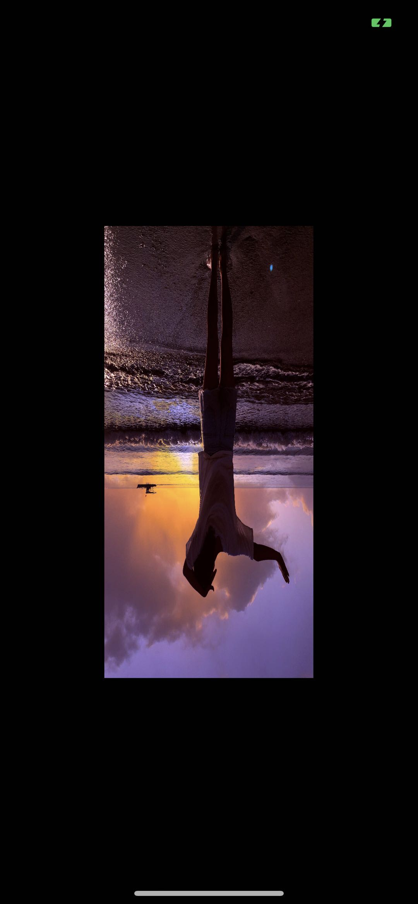
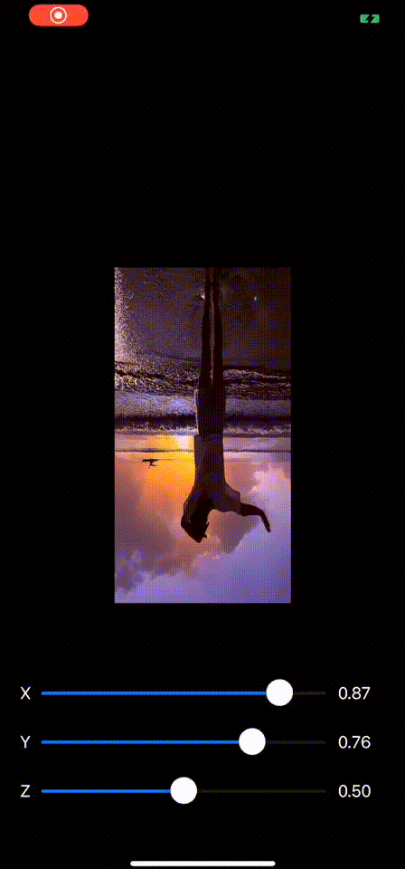

## 矩阵

>矩阵的理解是学好CG最重要的一个环节，建议多思考，多动手，多阅读相关资料，这里处于本章节考虑，只做简单的变换矩阵讲解，并不会对齐次坐标、模型、观察和投影矩阵做讲解

### 放缩

### 局部放缩

- 相对坐标原点的比例变换 A（x，y，z）旋转后变为A'（xSx， ySy， zSz）, Sx, Sy, Sz为缩放因子缩放变换矩阵为

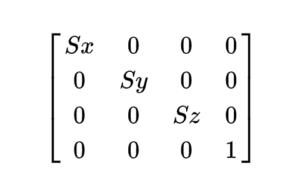

- 点A的矩阵乘以缩放变换矩阵得到旋转后的矩阵为

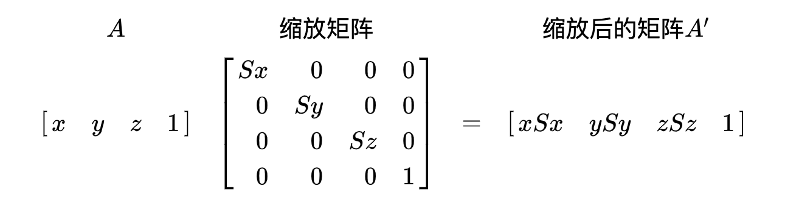

### 整体放缩

- 放缩矩阵为

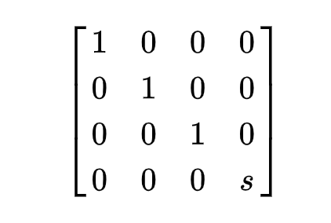

- 点A的矩阵乘以缩放变换矩阵得到旋转后的矩阵为

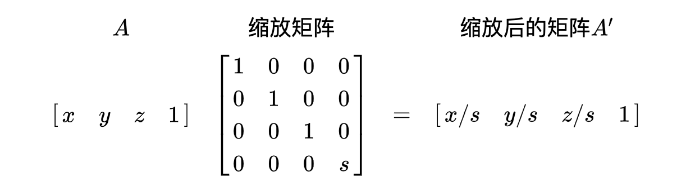

### 旋转

> 说明：矩阵中的θ是图形绕坐标轴逆时针旋转的角度

#### 绕 Z 轴旋转

- A（x，y，z）旋转后变为A'（xcosθ - ysinθ， xsinθ + ycosθ， z）旋转变换矩阵

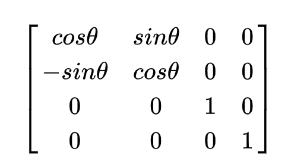

- 点A的矩阵乘以旋转变换矩阵得到旋转后的矩阵为

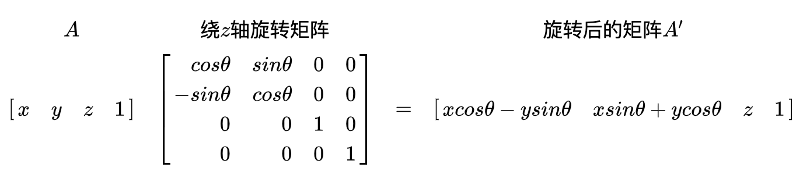

#### 绕 Y 轴旋转

- A（x，y，z）旋转后变为A'（xcosθ + zsinθ，y， zcosθ - xsinθ）旋转变换矩阵

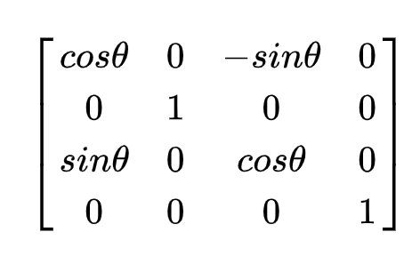

- 点A的矩阵乘以旋转变换矩阵得到旋转后的矩阵为


#### 绕 X 轴旋转

- A（x，y，z）旋转后变为A'（x， ycosθ - zsinθ， ysinθ + zcosθ）旋转变换矩阵

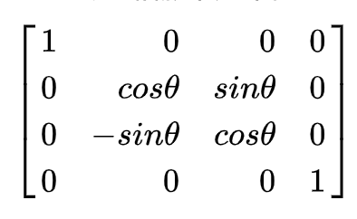

- 点A的矩阵乘以旋转变换矩阵得到旋转后的矩阵为

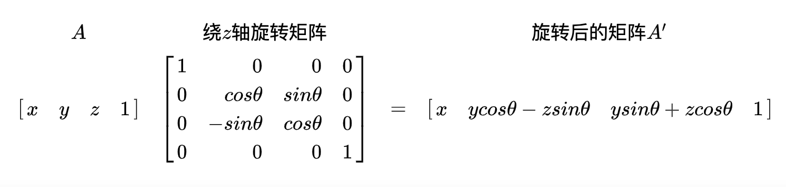

### 平移

- 平移向量 P 为（tx, ty, tz）， 点 A （x, y, z）平移后变为 A‘（x + tx, y + ty, z + tz）点 A 的矩阵为[x, y, z, 1]，平移变换矩阵为


- 点 A 的矩阵乘以平移变换矩阵得到平移后的矩阵为

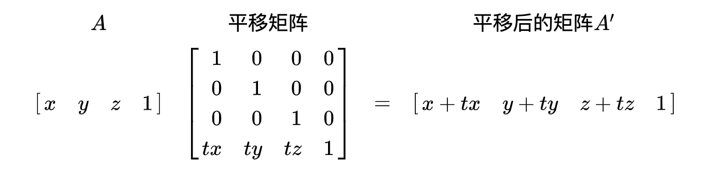

### 思考

- 三维顶点坐标(x,y,z)，现在引入一个新的分量w，得到向量(x,y,z,w)，那么 w 是 0 或者 1 有什么区别？
- 平移变换中，左乘和右乘对于平移矩阵会有什么不同？
- 为什么我讲解的顺序是放缩、旋转、平移？
- 如何同时进行X、Y、Z轴的旋转变换？应该注意什么？

### 步骤(目的绘制一张纹理)

#### 渲染管线简述
> 其实主要就是如下三个阶段：应用阶段—>几何阶段—>光栅化阶段；小白请进入 [渲染管线扫盲](https://zhuanlan.zhihu.com/p/61216531) 如果有一定的基础，想继续巩固，那请阅读上面提到的 [GPU 编程与 CG 语言之阳春白雪下里巴人](https://github.com/yungangwang/Study-Notes/tree/master/Content/%E3%80%8AGPU%20%E7%BC%96%E7%A8%8B%E4%B8%8E%20CG%20%E8%AF%AD%E8%A8%80%E4%B9%8B%E9%98%B3%E6%98%A5%E7%99%BD%E9%9B%AA%E4%B8%8B%E9%87%8C%E5%B7%B4%E4%BA%BA%E3%80%8B) 想了解GLSL语法可以参阅 [GLSL](https://colin1994.github.io/2017/11/11/OpenGLES-Lesson04/) 这里就不做过多的讲解。

- 顶点着色器
    > 习惯上，我们一般把顶点着色器命名为 xx.vsh，这里命名为 display.vsh，可通过 XCode 新建一个资源文件修改获得

    ```c
    attribute vec4 position;
    attribute vec2 textureCoordinate;
    varying lowp vec2 vTextCoord;
    void main() { // 顶点着色器的目标是输出顶点;
        vTextCoord = textureCoordinate;
        gl_Position = position; // 输出的顶点;
    }
    ```


- 片元着色器
    > 习惯上，我们一般把片段着色器命名为 xx.fsh，这里命名为 display.fsh，可通过 XCode 新建一个资源文件修改获得

    ```c
    varying lowp vec2 vTextCoord;
    uniform sampler2D colorMap;
    void main() { // 片元着色器的目标是输出像素颜色;
        gl_FragColor = texture2D(colorMap, vTextCoord); // 输出的像素颜色;
    }
    ```

#### 自定义GLView

- 获取 UIView 的 CAEAGLLayer
    > CAEAGLLayer 提供的两项主要功能，首先，它为 [RenderBuffer](https://zhuanlan.zhihu.com/p/81336334) 分配共享存储；其次，它将渲染缓冲区呈现给 Core Animation，用 [RenderBuffer](https://zhuanlan.zhihu.com/p/81336334) 中的数据替换了以前的内容。

    ```objc
    + (Class)layerClass {
        return [CAEAGLLayer class]; // 只有 [CAEAGLLayer class] 类型的 layer 才支持在其上描绘 OpenGL 内容;
    }
    ```

- 创建上下文并设置

    ```objc
    - (void)setupContext:(EAGLContext *)context {
        self.eaglContext = context; /*设置上下文信息*/
        
        if (!self.eaglContext) {
            NSLog(@"eaglContext is nil !");
        }
        
        if ([EAGLContext currentContext] != self.eaglContext) {
            if (![EAGLContext setCurrentContext:self.eaglContext]) {
                NSLog(@"failure set eaglContext !");
            }
        }
    }
    ```

- 创建 RenderBuffer & FrameBuffer
    > 通过调用上下文的 renderbufferStorage:fromDrawable: 方法并传递层对象作为参数来分配其存储空间。宽度，高度和像素格式取自层，用于为 [RenderBuffer](https://zhuanlan.zhihu.com/p/81336334) 分配存储空间。[RenderBuffer](https://zhuanlan.zhihu.com/p/81336334) 对象是新引入的用于屏幕外渲染，它允许将场景直接渲染到 [RenderBuffer](https://zhuanlan.zhihu.com/p/81336334) 对象，而不是渲染到纹理对象。[RenderBuffer](https://zhuanlan.zhihu.com/p/81336334) 只是一个包含可渲染内部格式的单个映像的数据存储对象，它用于存储没有相应纹理格式的 OpenGL 逻辑缓冲区，例如模板或深度缓冲区。

    ```objc
    - (void)bindColorRenderBuffer {
        glGenRenderbuffers(1, &_colorRenderBuffer);
        glBindRenderbuffer(GL_RENDERBUFFER, self.colorRenderBuffer);
        [self.eaglContext renderbufferStorage:GL_RENDERBUFFER fromDrawable:self.eaglLayer];
    }

    - (void)bindColorFrameBuffer {
        glGenFramebuffers(1, &_colorFrameBuffer);
        glBindFramebuffer(GL_FRAMEBUFFER, self.colorFrameBuffer);
        glFramebufferRenderbuffer(GL_FRAMEBUFFER, GL_COLOR_ATTACHMENT0, GL_RENDERBUFFER, self.colorRenderBuffer);
    }
    ```

- 编译 & 链接 Shader

    ```objc
    - (BOOL)compileShader:(GLuint *)shader type:(GLenum)type file:(NSString *)shaderFile {
        // 获取文件的内容并进行 NSUTF8StringEncoding 编码;
        const GLchar *source;
        source = (GLchar *)[[NSString stringWithContentsOfFile:shaderFile encoding:NSUTF8StringEncoding error:nil] UTF8String];
        if (!source) {
            NSLog(@"Failed to load vertex shader");
            return NO;
        }
        
        // 根据类型创建着色器;
        *shader = glCreateShader(type);
        
        // 获取着色器的数据源;
        glShaderSource(*shader, 1, &source, NULL);
        
        // 开始编译;
        glCompileShader(*shader);
        
        // 方便调试，可以不用;
        #if defined(DEBUG)
        GLint logLength;
        glGetShaderiv(*shader, GL_INFO_LOG_LENGTH, &logLength);
        if (logLength > 0) {
            GLchar *log = (GLchar *)malloc(logLength);
            glGetShaderInfoLog(*shader, logLength, &logLength, log);
            NSLog(@"Shader compile log:\n%s", log);
            free(log);
        }
        #endif
        
        // 查看是否编译成功;
        GLint status;
        glGetShaderiv(*shader, GL_COMPILE_STATUS, &status);
        if (status == 0) {
            glDeleteShader(*shader);
            return NO;
        }
        return YES;
    }

    - (BOOL)linkProgram:(GLuint)prog {
        // 链接程序;
        glLinkProgram(prog);
            
        #if defined(DEBUG)
        GLint logLength;
        glGetProgramiv(prog, GL_INFO_LOG_LENGTH, &logLength);
        if (logLength > 0) {
            GLchar *log = (GLchar *)malloc(logLength);
            glGetProgramInfoLog(prog, logLength, &logLength, log);
            NSLog(@"Program link log:\n%s", log);
            free(log);
        }
        #endif
        
        // 检查链接结果;
        GLint status;
        glGetProgramiv(prog, GL_LINK_STATUS, &status);
        if (status == 0) {
            return NO;
        }
        return YES;
    }
    ```

- 绘制

    ```objc
    - (void)processRender {
        glClearColor(0, 0, 0, 1.0);
        glClear(GL_COLOR_BUFFER_BIT);
        
        CGFloat scale = [[UIScreen mainScreen] scale]; // 获取视图放大倍数，可以把scale设置为1试试;
        glViewport(self.frame.origin.x * scale, self.frame.origin.y * scale, self.frame.size.width * scale, self.frame.size.height * scale); // 设置视口大小;
        
        glUseProgram(self.displayProgram); // 链接成功才能使用;

        glDrawArrays(GL_TRIANGLES, 0, 6); // DC;
        
        // 将指定 renderbuffer 呈现在屏幕上，在 renderbuffer 被呈现之前，首先调用 renderbufferStorage:fromDrawable: 为之分配存储空间;
        [self.eaglContext presentRenderbuffer:GL_RENDERBUFFER];
    }
    ```
#### 思考

- 为什么绘制的图片是倒的？如何修改？
- 如果注释掉 - (void)drawRect:(CGRect)rect 函数，绘制是否正常？为什么？

### 参阅

- [GPU 编程与 CG 语言之阳春白雪下里巴人](https://github.com/yungangwang/Study-Notes/tree/master/Content/%E3%80%8AGPU%20%E7%BC%96%E7%A8%8B%E4%B8%8E%20CG%20%E8%AF%AD%E8%A8%80%E4%B9%8B%E9%98%B3%E6%98%A5%E7%99%BD%E9%9B%AA%E4%B8%8B%E9%87%8C%E5%B7%B4%E4%BA%BA%E3%80%8B) 
- [GLSL 语法](https://colin1994.github.io/2017/11/11/OpenGLES-Lesson04/)
- [渲染管线扫盲](https://zhuanlan.zhihu.com/p/61216531)