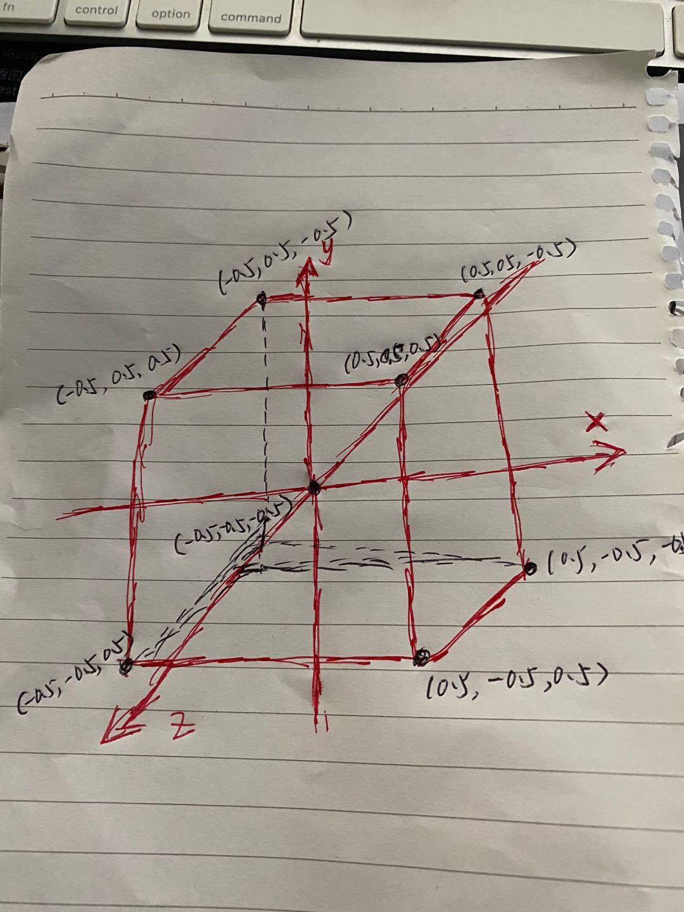
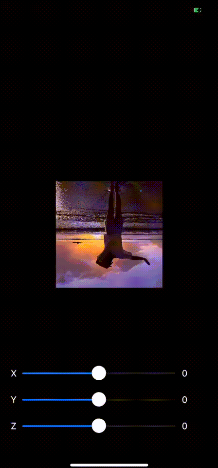
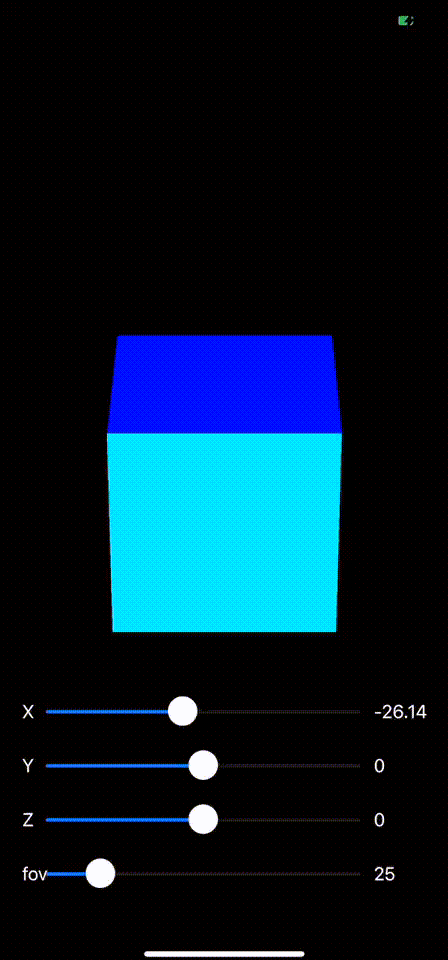
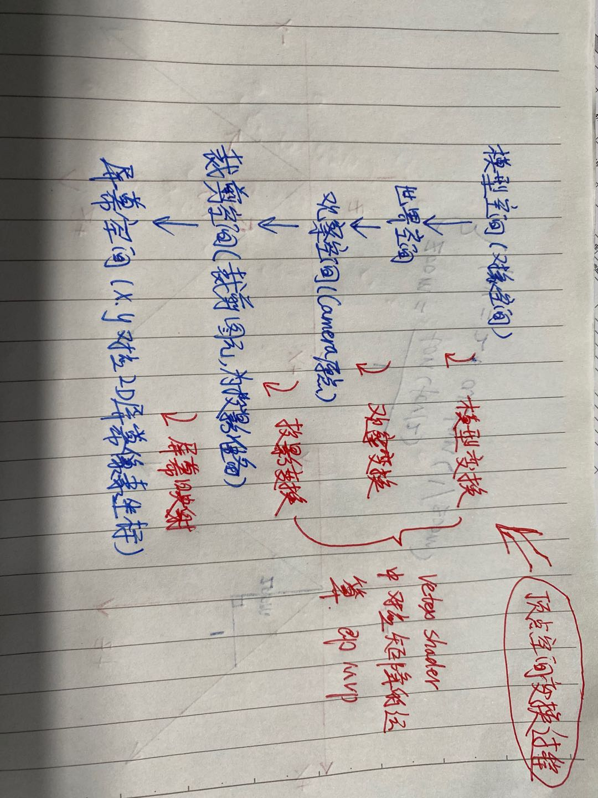

# ios-mvp

>It always seems impossible until its done. 
在事情未成功之前，一切总看似不可能。 
　　　　　　　　　　　　　　　-----《曼德拉》

## 环境

>XCode Version 11.3.1 (11C504) 
OpenGL ES 2.0 

## 目的

>前面我们简单的讲解和 DEMO 了下 GLKit 和 GLES 在 iOS 端的基本绘制流程和简单的矩阵运算，对 GLES 和 Shader 有了简单的认识和了解，对于矩阵的简单运算也有了一定的基础（如果看了前面的文章，同时做了相关专项学习的童鞋），接下来本章将主要讲解模型（Model）、观察（View）和投影（Projection）矩阵在GLES渲染中的实际应用。

## 效果

 

## 复合变换：模型观察投影矩阵（MVP）

>渲染流水线上一个很重要的环节就是将就是把模型的顶点坐标从模型空间转换到齐次剪裁空间中，渲染过程可以理解成把一个一个顶点经过层层处理最终转化到屏幕上的过程，其实这也是顶点着色器的主要任务，MVP就是其中非常重要的一个环节.

### 齐次坐标（Homogeneous coordinates）
>实投影平面可以看作是一个具有额外点的欧氏平面，这些点称之为无穷远点，并被认为是位于一条新的线上（该线称之为无穷远线）。每一个无穷远点对应至一个方向（由一条线之斜率给出），可非正式地定义为一个点自原点朝该方向移动之极限。在欧氏平面里的平行线可看成会在对应其共同方向之无穷远点上相交。给定欧氏平面上的一点(x,y)，对任意非零实数 Z，三元组(xZ,yZ,Z)即称之为该点的齐次坐标。

### 笛卡尔坐标（Cartesian coordinates）
>笛卡尔坐标系就是直角坐标系和斜角坐标系的统称。 相交于原点的两条数轴，构成了平面放射坐标系。如两条数轴上的度量单位相等，则称此放射坐标系为笛卡尔坐标系。两条数轴互相垂直的笛卡尔坐标系，称为笛卡尔直角坐标系，否则称为笛卡尔斜角坐标系。

### 顶点空间变换

### 思考
>为什么不是 PVM 而是 MVP ？ 
>如果调整了 MVP 的顺序，渲染效果会发生什么变化 ？