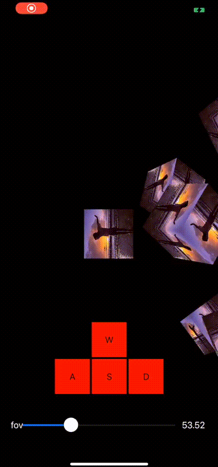
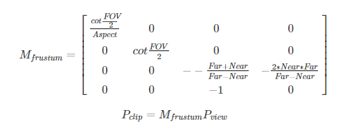
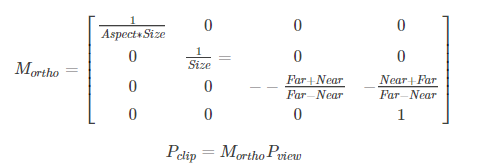
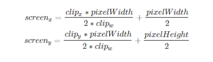

# ios-camera

>在时间的大钟上，只有两个字「现在」。 
　　　　　　　　　　　　　　　-----《莎士比亚》

## 环境

>XCode Version 11.3.1 (11C504) 
OpenGL ES 2.0 

## 目的

>上一章节将我们主要讲解了模型（Model）、观察（View）和投影（Projection）矩阵在GLES渲染中的实际应用，也通过kesalin实现的KS数学库进行了简单的投影相机和正交相机的实现，这一章节主要学习如何使用开源GLM库实现我们经常在游戏引擎中熟悉的Camera类，从而开启实现渲染引擎的基础。

## 效果

 

## 问题

>我们绘制时候经常打交道的顶点需要经过多个坐标空间的转换才能够被画到屏幕上？ 

- 上一章节我们绘制了一张图，模型空间（通过模型变换）-> 世界空间（通过观察变换）-> 观察空间（通过投影变换）-> 屏幕空间（屏幕映射），下面我们在继续复习一下上几节实验的一些基础概念加深了解。

### 模型空间
- 模型空间(Model Space)，也成为对象空间(Object Space)或局部空间(Local Space)。每个模型都有自己的模型空间，当它旋转或移动时，模型空间也会随之移动。
- 我们熟知的U3D和UE4游戏引擎都是左手坐标系，X轴正向为右，Z轴正向为上，Y轴正向向后，因此+x，+y，+z+x，+y，+z轴分别对应模型的右、上、向前。当然，模型空间的原点和坐标轴通常是由美术人员在建模软件（Maya & 3DMax）中确定好的。

### 世界空间
- 世界空间(World Space)是一个宏观的特殊坐标系，它代表了我们关心的最大坐标系。
- 将顶点坐标从模型空间变换到世界空间，称为模型变换(Model Transform)。

### 观察空间
- 观察空间（View Space）也被称为摄像机空间(Camera Space）。和其他空间不同的是观察空间使用的是右手坐标系，也就是是说，+x+x轴指的是右方，+y+y轴指的是左方，+z+z轴则是摄像机的后方。
- 顶点变换的后一步就是从世界空间变换到观察空间中，这个变换叫做观察变换(View Transform)。
- 得到观察变换矩阵有两种方法，一种是计算观察空间的三个坐标轴在世界空间下的表示，然后构建变换矩阵；另一种是想象平移整个观察空间，其核心就是将摄像机想象移动到与世界坐标重合的位置，再对z轴分量取反。
- 我们依旧可以从摄像机的Transform信息中拿到摄像机在世界空间的变换过程。

    

- 从右往左依次是平移矩阵、旋转矩阵、缩放矩阵，最后是取反矩阵(因为摄像机是右手坐标系)。

### 裁剪空间
- 顶点还需要从观察空间转换到裁剪空间(Clip Space，也叫作齐次裁剪空间)，其矩阵是裁剪矩阵(Clip Matrix)，也叫作投影矩阵(Projection Matrix)。
- 视椎体(view frustum)会决定对渲染图元的裁剪。
- 视椎体是决定摄像机可以看到的区域，由6个平面组成，称为裁剪平面，其中还有两个近裁剪平面(Near Clip Plane)和远裁剪平面(Far Clip Plane)，其决定了摄像机可以看到的深度范围。
- 视椎体还有两种类型：透视投影(Perspective Projection)和正交投影(Orthographic Projection)。
- 在这个步骤中，会使用投影矩阵把顶点转换到裁剪空间中，透视投影矩阵如下：

    

### 正交投影
- 和投影矩阵不同的本质在于最后一行的分量不一样。同样，正交投影也会改变空间的旋向性，正交投影矩阵如下：

    

### 屏幕空间
- 裁剪后需要进行真正的投影，需要把视椎体投影到屏幕空间空(Screen Space)，最后会得到像素位置。
- 将顶点从裁剪空间投影到屏幕空间，来生成2D坐标。
- 第一步，需要进行齐次除法(Homogeneous Diision)，就是使用齐次坐标系中的ww分量去除以x,y,zx,y,z分量，在OpenGL中这一步得到的坐标也被乘坐归一化的设备坐标(Normalized Device Coordinated, NDC)。
- 把坐标从齐次裁剪坐标中转化到NDC中，最后的裁剪空间会变换到一个立方体中。分量范围在[-1, 1]。
- 在U3D中，屏幕左下角是(0,0)，右上角是(pixelWidth, pixelHeight)，由于立方体内的坐标都是[-1,1]，因此映射过程就是一个缩放的过程。
- 齐次除法和屏幕映射可以总结为下面的公式：

    

- 此外，从裁剪空间到屏幕空间的转换是由底层帮我们完成的。

### 思考
>如何推到计算投影矩阵和正交矩阵？ 
